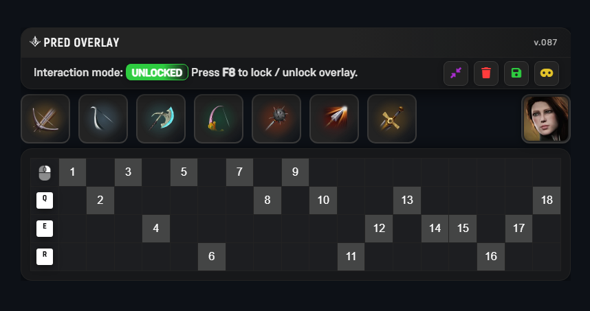

# PredOverlay

<div align="center">
  
  
  **A Modern Game Overlay Tool for Strategic Planning**
  
  [](https://github.com/your-repo/predoverlay)
  [](https://electronjs.org/)
  [](LICENSE)
</div>

---

## 🎯 Overview

**PredOverlay** is a modern, purpose-built overlay application designed exclusively for Predecessor, the fast-paced third-person MOBA. This tool provides real-time item management, hero selection, and skill order planning — all optimized to enhance strategic decision-making before and during your matches.

### ✨ Features

 🧠 **Smart Hero Suggestions**: Get real-time counter picks and synergy tips based on the draft.
- 📊 **Build Path Guidance**: Adapt your itemization depending on enemy comp and lane role.
- 🎯 **Objective Timers**: Visual cues for Fangtooth, Orb Prime, and jungle respawns.
- 🧩 **Modular UI**: Toggle panels such as mini-map overlays, ward reminders, and cooldown tracking.
- 🎮 **Zero Input Interference**: Fully mouse-driven or toggle via hotkey, does not intercept game input.

---

## 🚀 Quick Start

### Prerequisites

- **Node.js** (v14 or higher)
- **Python** (for data fetching scripts)
- **Windows/macOS/Linux** (Windows recommended for overlay features)

### Installation

1. **Clone the repository**
   ```bash
   git clone https://github.com/YanX94/PredOverlay.git
   cd predoverlay
   ```

2. **Install dependencies**
   ```bash
   npm install
   ```

3. **Launch the application**
   ```bash
   npm start
   ```

---

## 🎛️ Interface Guide

### Header Section
```
┌─────────────────────────────────────────────────────────┐
│ 🎯 PRED OVERLAY                            v.087        │
│ Interaction mode: UNLOCKED                              │
│ Press F8 to lock/unlock overlay      [🔄][🗑️][💾][🎭] │
└─────────────────────────────────────────────────────────┘
```

- **Status Indicator**: Shows LOCKED/UNLOCKED state
- **Resize Button** (🔄): Cycle through overlay sizes
- **Clear Button** (🗑️): Reset all configurations
- **Save Button** (💾): Manual configuration save
- **Hero Button** (🎭): Open hero selection

### Item Inventory
```
┌────┐ ┌────┐ ┌────┐ ┌────┐ ┌────┐ ┌────┐ ┌────┐     ┌────┐
│ 1  │ │ 2  │ │ 3  │ │ 4  │ │ 5  │ │ 6  │ │ 7  │ ... │ 👤 │
└────┘ └────┘ └────┘ └────┘ └────┘ └────┘ └────┘     └────┘
```

- **7 Item Slots**: Store your item build
- **Hero Preview**: Shows selected hero portrait

### Skill Order Table
```
┌────┬──┬──┬──┬──┬──┬──┬──┬──┬──┬──┬──┬──┬──┬──┬──┬──┬──┬──┐
│ 🖱️ │ 1│ 2│ 3│ 4│ 5│ 6│ 7│ 8│ 9│10│11│12│13│14│15│16│17│18│
├────┼──┼──┼──┼──┼──┼──┼──┼──┼──┼──┼──┼──┼──┼──┼──┼──┼──┼──┤
│ Q  │  │  │ 1│  │  │ 2│  │  │ 3│  │  │ 4│  │  │ 5│  │  │  │
│ W  │  │ 1│  │  │ 2│  │  │ 3│  │  │ 4│  │  │ 5│  │  │  │  │
│ E  │ 1│  │  │ 2│  │  │ 3│  │  │ 4│  │  │ 5│  │  │  │  │  │
│ R  │  │  │  │  │  │ 1│  │  │  │  │  │ 2│  │  │  │  │  │ 3│
└────┴──┴──┴──┴──┴──┴──┴──┴──┴──┴──┴──┴──┴──┴──┴──┴──┴──┴──┘
```

---

## ⌨️ Keyboard Shortcuts

| Shortcut | Function | Description |
|----------|----------|-------------|
| **F8** | Toggle Lock | Switch between clickable/click-through modes |
| **F7** | Force Focus | Emergency overlay restoration to foreground |
| **Right-Click** | Context Actions | Clear items, remove skill points |
| **Double-Click** | Show/Hide | Toggle overlay visibility (tray icon) |

---

## 🔧 Advanced Features

### Overlay Modes

#### 🔓 Unlocked Mode
- **Interactive**: Full mouse and keyboard interaction
- **Configurable**: Modify items, skills, and settings
- **Visual Feedback**: Hover effects and animations active

#### 🔒 Locked Mode  
- **Click-Through**: Mouse passes through to game
- **Read-Only**: View-only mode for gameplay reference
- **Reduced Interaction**: Locked elements cannot be modified

### Audio System

PredOverlay includes rich audio feedback:
- **Click Sounds**: Satisfying click feedback for interactions
- **Item Selection**: Audio cue when selecting items
- **Hero Selection**: Sound effect for hero changes
- **Volume Control**: Sounds are pre-balanced at 60% system volume

### Scaling System
- **Multiple Sizes**: Resize button cycles through different scales
- **Smart Scaling**: Maintains aspect ratio and positioning
- **Instant Apply**: No restart required for size changes

### Data Management

#### Auto-Fetching
- **Hero Database**: Updated from JSON files via Python scripts
- **Item Database**: Fresh item data with each launch
- **Image Assets**: Efficient asset management and caching

#### Storage System
- **Per-Hero Configs**: Each hero saves independent settings
- **LocalStorage**: Browser-based persistence
- **JSON Format**: Human-readable configuration files

---

## 🛠️ Development

### Project Structure
```
predoverlay/
├── assets/
│   ├── images/          # Icons and UI graphics
│   ├── sounds/          # Audio feedback files
│   ├── style/           # CSS stylesheets
│   └── fonts/           # Custom typography
├── js/
│   ├── script.js        # Core application logic
│   └── sounds.js        # Audio management
├── python/
│   └── json/            # Data fetching scripts
├── main.js              # Electron main process
├── index.html           # Application interface
└── package.json         # Project configuration
```

### Build Process
```bash
# Development mode
npm run dev

# Production build
npm run build

# Package for distribution
npm run dist
```

---

## 🤝 System Tray Integration

PredOverlay runs efficiently in your system tray:

### Tray Features
- **🖱️ Double-click**: Show/hide overlay
- **📋 Right-click menu**:
  - Show Overlay
  - Hide Overlay
  - Toggle Interaction (F8)
  - Force Foreground (F7)
  - Quit

### Background Operation
- **Minimal Resources**: Efficient memory and CPU usage
- **Always Available**: Persistent system tray presence
- **Quick Access**: Instant overlay activation

---

## 📋 System Requirements

### Minimum Requirements
- **OS**: Windows 10, macOS 10.13, Ubuntu 18.04
- **RAM**: 4GB (2GB available)
- **Storage**: 500MB free space
- **Display**: 1920x1080 (recommended)

### Recommended Setup
- **OS**: Windows 11 (best overlay support)
- **RAM**: 8GB or higher
- **GPU**: Dedicated graphics card
- **Network**: Broadband (for data updates)

---

## 🐛 Troubleshooting

### Common Issues

#### Overlay Not Visible
1. Press **F7** to force overlay to foreground
2. Check if overlay is in click-through mode (press **F8**)
3. Look for the tray icon and double-click it

#### No Sound Effects
1. Verify system audio is working
2. Check Windows volume mixer for PredOverlay
3. Restart the application

#### Performance Issues
1. Close unnecessary applications
2. Use the resize button to reduce overlay scale
3. Disable hardware acceleration (automatically done)

#### Data Not Loading
1. Check internet connection for Python data scripts
2. Verify Python installation
3. Restart the application

---

## 📝 License

This project is licensed under the **GNU General Public License v3.0** - see the [LICENSE](LICENSE) file for details.

### GPL v3.0 Summary
- ✅ **Commercial use** - You can use this software commercially
- ✅ **Modification** - You can modify the source code
- ✅ **Distribution** - You can distribute this software
- ✅ **Patent use** - Express grant of patent rights from contributors
- ⚠️ **Copyleft** - Derivative works must be under the same license
- ⚠️ **Disclose source** - Source code must be made available
- ⚠️ **License and copyright notice** - Must include license and copyright notice

---

## ☕ Support the Project

If you find PredOverlay useful, consider [buying me a coffee](https://buymeacoffee.com/yannoel94n). Your support helps with future features like draft tracking, advanced teamfight stats, timers, and more.

---

## 🎯 Support

For support, feature requests, or bug reports:

- **📧 Email**: yannoel94@gmail.com
- **🐛 Issues**: [GitHub Issues](https://github.com/YanX94/PredOverlay/issues)
- **💬 Discord**: [Join our community](https://discord.gg/7y39ZYesyB)

---

## 🤝 Contributing

Contributions are welcome! Since this project is under GPL v3.0:

1. **Fork** the repository
2. **Create** your feature branch (`git checkout -b feature/AmazingFeature`)
3. **Commit** your changes (`git commit -m 'Add some AmazingFeature'`)
4. **Push** to the branch (`git push origin feature/AmazingFeature`)
5. **Open** a Pull Request

Please ensure your contributions comply with the GPL v3.0 license terms.

---

<div align="center">
  <sub>Built with ❤️ for the Predecessor community</sub>
  <br>
  <sub>Licensed under GPL v3.0 - Freedom to use, study, share and improve</sub>
</div>